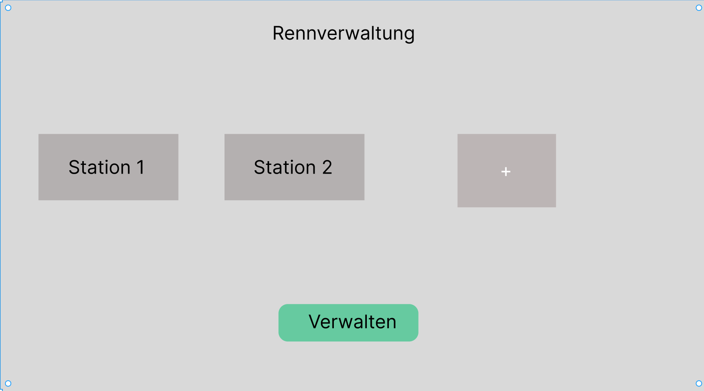

= Pflichtenheft Racemanagement
:toc: left
:sectnums:
:toclevels: 1
:table-caption:

Version: 1.0

Version Date: 05-03-2024

Authors:
- Saydam Arda
- Kurtic Ademir

== Beschreibung der Ausgangslage

== Ist-Zustand

Bei den Rennen ist nicht bestimmt welche Autos oder welche Bedienung an der jeweiligen Station benutzt wird.

== Problemstellung

Es gibt keine Verwaltung der Autos und der Bedienung. Es ist meist unklar welches Auto oder welche Bedienung an welcher Station benutzt wird.

== Aufgabenstellung

=== Funktionale Anforderungen
==== Use-case diagram

==== Mockup
.Home
[%collapsible]
====

In der Startseite sind alle Stationen aufgelistet. Mit dem Plus-Button kann der Benutzer / die Benutzerin neue Stationen hinzufügen bzw mit dem Verwalten-Button löschen.
Nach dem Klick auf eine Station, wird der Benutzer / die Benutzerin auf die Seite der Station weitergeleitet
====
.Station
[%collapsible]
====
image::images/img_1.png[]
Bei der Stationsübersicht sind alle Autos und Bedienungen aufgelistet. Mit dem Plus-Button kann der Benutzer neue Autos und Bedienungen hinzufügen. Die Autos und Bedienungen sind mittels Drop-Down-Menüs auswählbar. Nach dem der Benutzer / die Benutzerin die Auswahl getroffen hat, kann mittels Start-Button das Rennen beginnen.
====

=== Nicht-funktionale Anforderungen

* Sicherheitsanforderung
- Die Daten sollen vor Dritten geschützt werden.

* Zuverlässigkeit
- Das System soll, in einer vorhersehbaren und zuverlässigen Weise zu funktionieren.

* Benutzbarkeit
- Das System soll, so gestaltet werden, dass es einfach und intuitiv von Benutzern verwendet werden kann.

* Übertragbarkeit
- Das System soll, mit dem Inventar etc. kommunizieren können.

* Wartbarkeit
- Das System soll, Wartungs- und Reparaturarbeiten in einfacher und schneller Weise durchführen können.

== Zielsetzung

Das Ziel ist es, eine App zu entwickeln, die die Verwaltung der Autos und der Bedienung an den Stationen ermöglicht.

== Rahmenbedingungen

Programmiersprache: ??

Datenbank: ??

== Lieferumfang

* App
* Datenbank

== Administratives

Kontakt: a.saydam@students.htl-leonding.ac.at

Team: Saydam Arda, Kurtic Ademir
